# Lab2Web
## CSS Dasar
### Membuat dokumen HTML
Buatlah dokumen HTML seperti berikut:

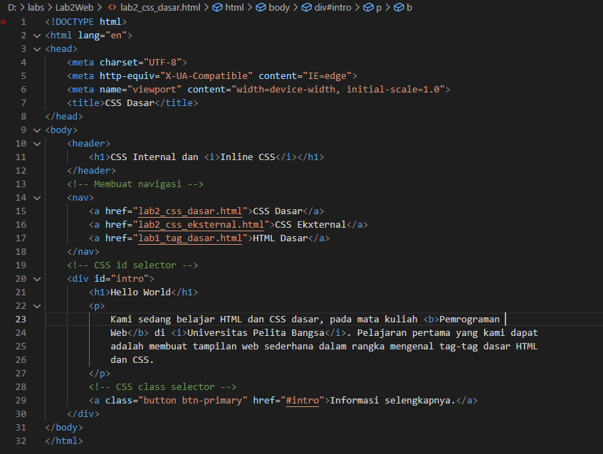

Dan ini tampilannya di browser, tampilannya masih polos karena belum menggunakan CSS.

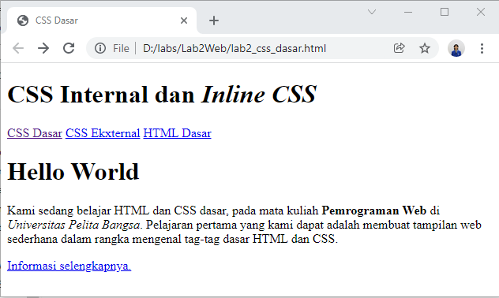

###  Mendeklarasikan CSS Internal
Untuk mendeklarasikan CSS internal menggunakan tag *<style>* yang di simpan di bagian tag '<head>'.

Untuk tag '<body>' menggunakan *selector body* yang diisi dengan "font-family:'Open Sans', sans-serif;".

Untuk tag *<header>* menggunakan *selector header* yang diisi dengan "min-height: 80px; border-bottom:1px solid #77CCEF;".

Untuk tag *<h1>* menggunakan *selector h1* yang diisi dengan "font-size: 24px; color: #0F189F; text-align: center; padding: 20px 10px;".

Dan untuk tag *<i>*  yang ada di dalam tag *<h1>* menggunakan *selector h1 i* yang diisi dengan "color:#6d6a6b;".

Ini gambarnya :

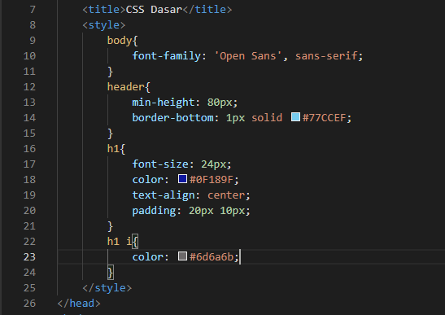

Ini tampilannya di browser :

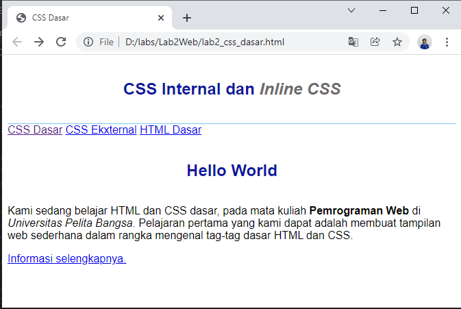

### Menambahkan Inline CSS
Agar bisa mendeklarasikan Inline CSS yaitu dengan cara menambahkannya di dalam tag *
*.

Seperti ini gambarnya :

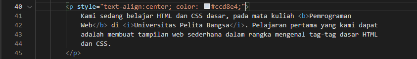

Kemudian ini tampilannya di browser :

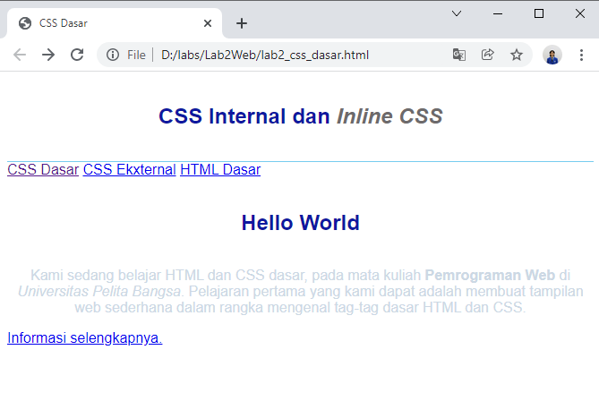

### Membuat CSS Eksternal
Cara pertama yaitu buat file baru dengan format .css, seperti contohnya style_eksternal.css

Kemudian isi file tadi dengan deklarasi CSS seperti di gambar.

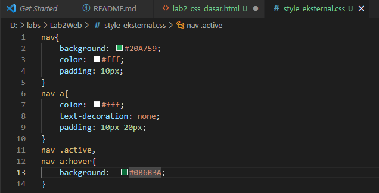

Di bagian tag *<nav>* di sisipkan hover agar pada saat di sentuh oleh kursor bagian tersebut akan berubah sesuai dengan deklarasi CSSnya.

Pada file HTML tambahkan tag *<link>* di bagian tag *<head>*.
Untuk href di isi dengan nama file CSS yang tadi sudah dibuat.

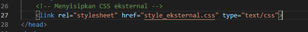

Ini tampilannya di browser :

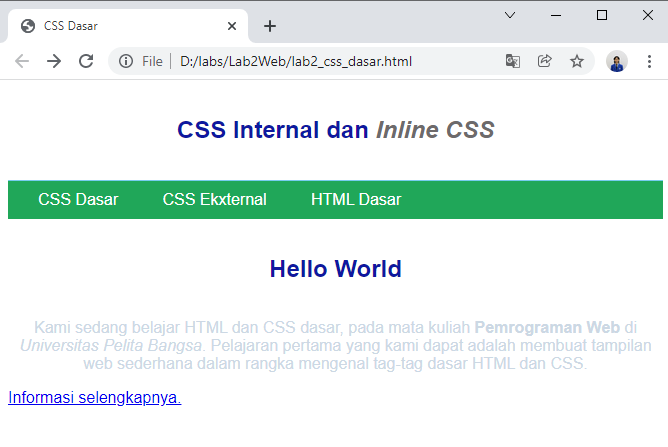

###  Menambahkan CSS Selector
Tambahkan kode berikut pada file stle_eksternar.css, untuk selector ID menggunakan tanda # dan untuk selector Class menggunakan tanda titik.

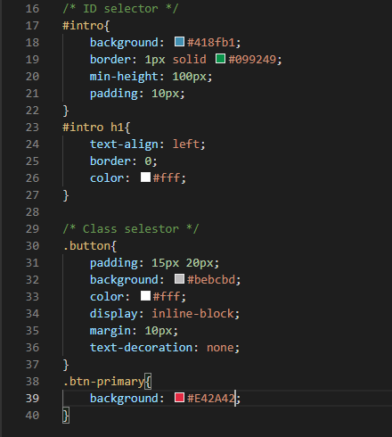

Dan ini tampilannya di browser :

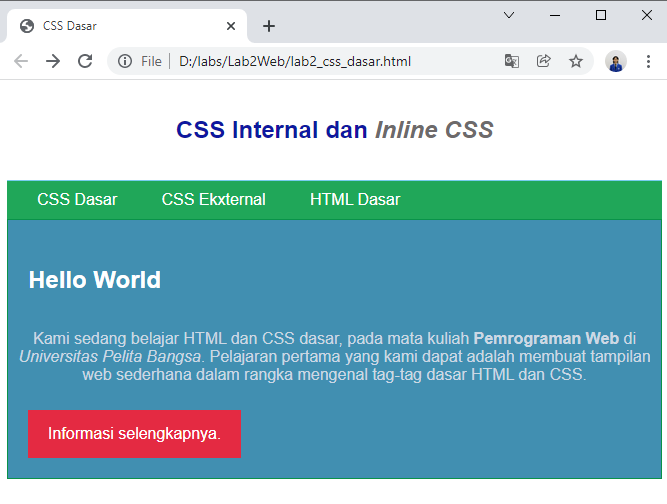

Nama ID atau nama Classnya harus sama dengan file HTML.

